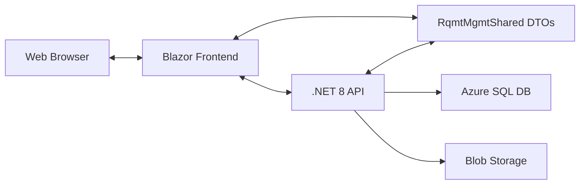
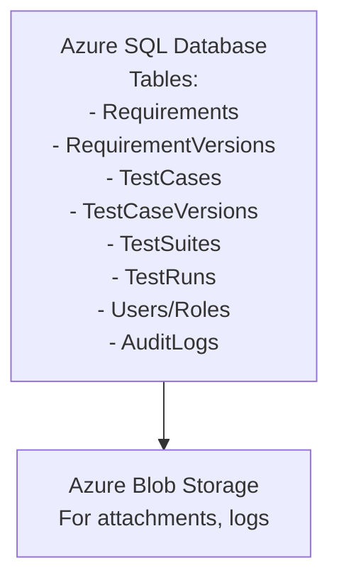
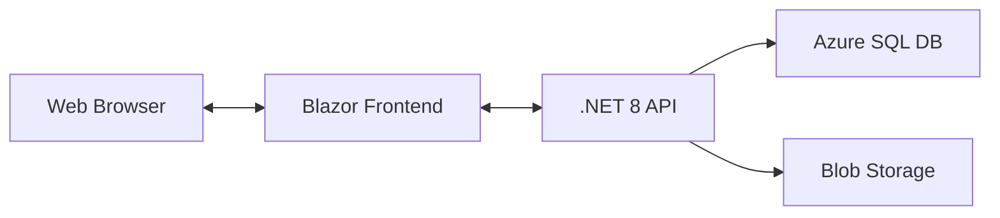

# Software Architecture Decisions for Requirements and Test Management Tool

## 1. Overview

This document outlines the software architecture decisions for developing a web-based requirements and test management tool. It covers the front-end and back-end technology choices, database selection, deployment considerations, and provides guidance for developers.

---

## 2. Front-End Architecture

- The front-end shall be a Single Page Application (SPA) accessible via modern web browsers (Chrome, Edge, Firefox, Safari).
- The front-end will be developed using Blazor WebAssembly for its seamless .NET integration and modern SPA capabilities.
- UI state management will use built-in .NET/Blazor patterns (e.g., cascading parameters, dependency injection, or Fluxor if needed) for scalability and maintainability.
- UI components will be based on MudBlazor (or another Blazor component library) for consistency and accessibility.
- The front-end will communicate with the back-end via RESTful APIs (JSON over HTTPS).
- Authentication will use OAuth 2.0 / OpenID Connect (OIDC) via a cloud identity provider (e.g., Azure AD, Okta).
- Responsive design will be ensured for desktop and tablet use.

### Shared Library Organization

- The solution includes a `RqmtMgmtShared` class library project containing all shared DTOs and data contracts.
- Both the front-end and back-end reference this shared library, ensuring type safety and eliminating duplication.
- This enables seamless, strongly-typed API integration between Blazor, Web API, and test projects.

---

## 3. Back-End Architecture

- The back-end will be developed using .NET 8 Web API for high performance, security, and cloud-native support.
- The back-end will expose RESTful endpoints for all major entities: CRS, PRS, SRS, Test Suites, Test Cases, Test Runs, Users, Roles.
- Authentication and authorization will be enforced at the API layer using JWT tokens from the identity provider.
- The back-end will be containerized using Docker for portability and scalability.
- Hosting will be in a cloud environment (e.g., Azure App Service, AWS ECS, or Google Cloud Run).
- The back-end will provide OpenAPI (Swagger) documentation for API consumers.

---

## 4. Database/Data Store Decision

- The system will use Microsoft Azure SQL Database as the primary data store for:
  - Enterprise-grade reliability, scalability, and security
  - ACID compliance and strong consistency for requirements and test data
  - Support for relational data, versioning, and complex queries
  - Integration with enterprise authentication and backup solutions
- Entity relationships (requirements, test cases, users, audit logs) will be modeled in normalized relational tables.
- Attachments (e.g., screenshots, logs) will be stored in Azure Blob Storage, referenced by URLs in the database.

---

## 5. Key Architectural Considerations

- All data access will be via repository/service patterns in the back-end.
- API versioning will be implemented to support future changes.
- The system will be designed for multi-tenancy and enterprise scalability.
- All communication will be over HTTPS.
- Audit logs will be maintained for compliance and traceability.
- Error handling and logging will use cloud-native monitoring (e.g., Azure Monitor).
- All requirements and test cases will be versioned in append-only version/history tables (e.g., RequirementVersions, TestCaseVersions), supporting comparison, rollback, and export of any historical version.
- The system will provide APIs and UI for generating redline documents that highlight the differences between any two versions or releases of requirements or test cases, supporting regulatory and quality audits.

---

## 7a. Implementation Status (August 2025)

### ✅ Completed Architecture Components

The following architectural goals have been successfully implemented:

#### **Identity & Authentication Infrastructure**
- **IdentityServer Integration**: Duende IdentityServer 7 configured with OAuth 2.0/OpenID Connect
- **JWT Token Authentication**: Backend API validates JWT tokens from IdentityServer
- **HTTPS Configuration**: Nginx reverse proxy with SSL/TLS termination for secure communication
- **Multi-Protocol Support**: Both HTTP (development) and HTTPS (production/testing) endpoints available
- **Certificate Management**: Self-signed certificates for development, ready for production certificates

#### **Domain Model Excellence**
- **Navigation Properties**: Comprehensive navigation properties implemented across all models
  - Requirement: Parent/Children hierarchy, Creator, Project, OutgoingLinks/IncomingLinks, TestCaseLinks
  - TestCase: Suite, Creator, TestPlanLinks, RequirementLinks, TestRuns, Steps
  - Project: Owner, TeamMembers, Requirements, TestSuites, TestPlans
  - User: RequirementsCreated, TestCasesCreated, TestSuitesCreated, TestPlansCreated, TestRuns, AuditLogs

#### **EF Core Configuration**
- **Relationship Configuration**: All relationships properly configured in RqmtMgmtDbContext
- **Foreign Key Constraints**: Proper cascade behaviors and constraint management
- **Composite Keys**: Junction tables (TestPlanTestCase, RequirementTestCaseLink) properly configured
- **Enum Conversions**: String conversion for all enum types (RequirementType, RequirementStatus, TestResult, etc.)

#### **Type Safety & Value Objects**
- **Enums Throughout**: RequirementType, RequirementStatus, TestResult, TestPlanType, TestRunStatus, ProjectStatus, ProjectRole
- **Shared Library**: All enums and DTOs centralized in RqmtMgmtShared for type consistency
- **Validation**: Enum usage enforces valid values across the application

#### **Service Layer Architecture**
- **Clean Separation**: Controllers are thin HTTP layers that delegate to services
- **Service Interfaces**: Well-defined interfaces in shared library (IRequirementService, ITestCaseService, etc.)
- **Dependency Injection**: Proper DI configuration throughout
- **Business Logic Isolation**: All business logic contained in service layer, not controllers
- **User Context Management**: Frontend components dynamically load current user via IUserService.GetCurrentUserAsync()

#### **Authentication & User Management**
- **Dynamic User Context**: Frontend components automatically load current authenticated user
- **Fallback Handling**: Graceful degradation when user context is unavailable (fallback to User ID 1)
- **Service Integration**: IUserService provides /api/User/me endpoint for current user information
- **Form Integration**: All creation forms (Requirements, Projects, Test Plans, Test Suites) use current user for CreatedBy/OwnerId fields

#### **Test Coverage**
- **732 Total Tests**: Comprehensive testing across all layers
- **Component Tests (73)**: bUnit-based frontend component testing
- **E2E Tests (53)**: Playwright-based browser automation
- **Unit Tests (499)**: Backend service and business logic testing  
- **API Tests (160)**: Integration testing with real database

### 🔧 Minor Improvements Needed

1. **RedlineController Refactoring**: Currently injects DbContext directly; should use service layer
2. **Frontend Code Consistency**: Add .editorconfig and Prettier/ESLint  
3. **Swagger Enhancement**: Expand API documentation features
4. **E2E Test Authentication**: Update frontend.E2ETests to handle SSL/HTTPS URLs and authentication workflows

### 📊 Architecture Maturity Assessment

| Component | Status | Coverage |
|-----------|---------|----------|
| **Domain Models** | ✅ Excellent | 100% |
| **Navigation Properties** | ✅ Complete | 100% |
| **EF Configuration** | ✅ Complete | 100% |
| **Service Layer** | ✅ Excellent | 95% |
| **Type Safety** | ✅ Complete | 100% |
| **Authentication** | ✅ Excellent | 100% |
| **HTTPS/Security** | ✅ Complete | 100% |
| **Test Coverage** | ✅ Excellent | 732 tests |
| **API Documentation** | ✅ Good | 90% |

---

## 8. Developer Guidance

- Follow SOLID and clean architecture principles in both front-end and back-end code.
- Ensure all business logic is in the back-end API, not in the front-end.
- Use environment variables for all secrets and configuration.
- Write automated unit and integration tests for all layers.
- Use CI/CD pipelines for build, test, and deployment (e.g., GitHub Actions, Azure DevOps).

---

## 7. Architectural Review & Recommendations (2025)

### Strategic Improvements (Critical & High Priority)

1. **✅ Domain Model Relationships** *(COMPLETED)*
   - ✅ Navigation properties implemented across all models (TestSuite in TestCase, Requirement hierarchies, User relationships, etc.)
   - ✅ EF Core relationships properly configured in DbContext with foreign keys and cascade behaviors
   - ✅ Enums used throughout for Status, Type, and Result fields (RequirementStatus, TestResult, ProjectStatus, etc.)
   - ✅ Composite keys configured for junction tables (TestPlanTestCase, RequirementTestCaseLink)

2. **✅ Service/Repository Layer & Separation of Concerns** *(MOSTLY COMPLETED)*
   - ✅ Service pattern implemented with interfaces in shared library (IRequirementService, ITestCaseService, etc.)
   - ✅ Controllers properly delegate to services with clean separation of concerns
   - ✅ Business logic isolated in service layer, not in controllers
   - 🔧 Minor: RedlineController needs refactoring to use service layer instead of direct DbContext injection

3. **Security & Identity**
   - Integrate Azure AD/OIDC authentication and policy-based authorization as soon as possible.
   - Extend AuditLog to capture the authenticated user’s claims principal.
   - Start enforcing role-based access control (RBAC) in your API endpoints.

### Medium-Priority Improvements

1. **Versioning & History**
   - Move beyond a simple Version integer for requirements and test cases—use append-only version/history tables (RequirementVersions, TestCaseVersions) to track all changes, enable redline comparison, rollback, and satisfy audit/compliance needs.
   - Implement API endpoints and UI features for generating redline documents showing the differences between any two versions or releases of requirements and test cases.

2. **DevOps & Cloud Readiness**
   - Add a Dockerfile and sample CI/CD pipeline (GitHub Actions or Azure DevOps).
   - Provide infrastructure-as-code (IaC) templates for cloud resources (SQL, Blob, App Service).
   - Add structured logging (Serilog, Application Insights) and API versioning (Swashbuckle, Microsoft.AspNetCore.Mvc.Versioning).

3. **Multi-Tenancy**
   - Document your multi-tenancy approach (row-level security, separate schema, or DB-per-tenant) or defer until a real need is validated, to avoid unnecessary complexity.

### Quick Wins

- ✅ EF Core navigation properties and foreign key constraints implemented.
- ✅ XML comments enabled throughout the codebase.
- 🔧 Add .editorconfig and Prettier/ESLint to the frontend for code consistency.
- 🔧 Enable Swagger documentation enhancements.

---

## 9. Diagrams

### High-Level Architecture

---

## 10. Summary Table

| Layer       | Technology        | Cloud Service      |
|-------------|-------------------|--------------------|
| Front-End   | Blazor, MudBlazor | Azure Static Web Apps / CDN |
| Back-End    | .NET 8 Web API    | Azure App Service  |
| Database    | Azure SQL         | Azure SQL Database |
| Attachments | Blob Storage      | Azure Blob Storage |
| Auth        | OAuth2/OIDC       | Azure AD           |

---

## 11. References

- [Blazor Documentation](https://learn.microsoft.com/aspnet/core/blazor/)
- [.NET 8 Documentation](https://docs.microsoft.com/dotnet/)
- [Azure SQL Database](https://azure.microsoft.com/en-us/products/azure-sql-database/)
- [Azure Blob Storage](https://azure.microsoft.com/en-us/products/storage/blobs/)
- [Material UI](https://mui.com/)
